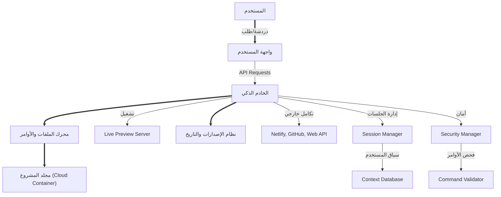

# 📚 المرجع الهندسي الشامل لبناء مساعد ذكاء اصطناعي سحابي لتطوير تطبيقات ويب (بدون تسجيل)

---

## 1. مقدمة النظام

نظام ذكاء اصطناعي سحابي متعدد اللغات (عربي/إنجليزي)، يتيح تطوير تطبيقات ويب حديثة بواسطة محادثة ذكية، تكامل كامل للأدوات، إدارة ملفات/إصدارات، نشر مباشر، حماية قصوى، كل ذلك دون تسجيل دخول إلا للتكاملات الخارجية، ويمنح تجربة مطابقة لمنصة Same العالمية.

### الميزات الأساسية
- **بدون حساب:** الدخول فورًا والبدء في البرمجة
- **ذكاء اصطناعي متفاعل:** يفهم اللغة، يقترح، يعدل، ويحل المشاكل
- **معاينة حيّة:** تعديل التطبيق ومشاهدته فوراً في نافذة مدمجة
- **إدارة نسخة المشروع:** حفظ وإصدار وتاريخ وتراجع تلقائي
- **دعم كامل لأطر العمل:** React/Vite/Nextjs/TypeScript/CSS/shadcn/ui
- **تكامل اختياري فقط:** Netlify, GitHub وغيرها — لا يُشترط إلا بموافقة المستخدم
- **سياسة أمان مشددة:** فصل كامل بين المشاريع، مسح كل شيء بعد الجلسة

---

## 2. الرسم البنيوي والتدفق التقني



### تدفق العمل المفصل
1. **بدء الجلسة:** إنشاء حاوية Docker منفصلة لكل مستخدم
2. **تحليل الطلب:** NLP + تحليل السياق + تحديد الإجراءات
3. **تنفيذ متوازي:** جميع العمليات تنفذ معاً (قراءة، تعديل، بحث)
4. **معاينة فورية:** تحديث Live Preview بعد كل تعديل
5. **حفظ الإصدار:** Snapshot تلقائي لكل مرحلة مهمة
6. **اقتراحات ذكية:** توجيه المستخدم للخطوة التالية

---

## 3. الهيكلية البرمجية والمجلدات

### تنظيم الملفات
```
project-root/
├── src/                    # كود المشروع الأساسي
│   ├── components/         # مكونات React/Next.js
│   ├── pages/             # صفحات التطبيق
│   ├── styles/            # ملفات CSS/SCSS
│   └── utils/             # أدوات مساعدة
├── public/                # صور وملفات المستخدم
├── node_modules/          # الحزم البرمجية المثبتة
├── .same/                 # ملفات النظام الخفي
│   ├── todos.md           # سجل الخطوات والمهام
│   ├── wiki.md            # توجيهات وتعليمات النظام
│   ├── history.md         # سجل التعديلات والتغييرات
│   ├── logs.md            # سجل التنفيذ والأخطاء
│   └── settings.json      # إعدادات اللغة/التكاملات/السياسات
├── package.json           # إعدادات وحزم المشروع
├── netlify.toml           # إعدادات النشر السحابي
└── README.md              # توثيق المشروع
```

### ملفات النظام الداخلية
| الملف/المجلد        | الوظيفة                                     | مرئي للمستخدم؟ |
|---------------------|---------------------------------------------|-------------------|
| .same/todos.md      | سجل المهام والمعالجة التلقائية              | لا                |
| .same/wiki.md       | سجل تعليمات النظام وتوجيهات الذكاء          | لا                |
| .same/history.md    | سجل التعديلات والنقاط الديناميكية           | لا                |
| .same/logs.md       | سجل تنفيذ الأوامر والفحص والنشر             | لا                |
| .same/settings.json | حفظ إعدادات اللغة والتكاملات الفعالة        | لا                |
| /src/               | كود المشروع الأساسي وجميع مكوناته           | نعم               |
| /public/            | صور وملفات المستخدم                         | نعم               |
| /node_modules/      | الحزم المثبتة                                | لا                |

---

## 4. الأدوات والخدمات المتكاملة

### جدول الأدوات الرئيسية
| الأداة          | الوظيفة الرئيسية                                              | مثال الاستخدام                                      | حدود الأمان                     |
|-----------------|-------------------------------------------------------------|-----------------------------------------------------|---------------------------------|
| startup         | إنشاء مشروع حديث بإطار عمل مناسب (React/Vite/Next...)      | bun create nextjs                                   | يسمح بقائمة محددة فقط           |
| edit_file       | تعديل أجزاء محددة من الملفات حسب الحاجة فقط                  | تغيير زر في صفحة رئيسية                             | لا يعدل إلا المطلوب            |
| read_file       | قراءة أي ملف أو جزء منه ضمن المشروع                          | قراءة 10 سطور من app.tsx                            | يقرأ جزء أو الكل بحجم محدود     |
| grep            | بحث سريع ومتوازي عن رمز أو كلمة في جميع الملفات             | البحث عن export default                             | ضمن المشروع فقط                |
| glob            | البحث بالنمط (ملفات/types/صور...)                           | **/*.tsx                                            | ضمن المسار المحدد               |
| string_replace  | استبدال نص فريد بكل الملف                                    | تغيير كلمة "الرئيسية" إلى "الصفحة الرئيسية"         | باستبدال فريد فقط               |
| run_linter      | فحص كود المشروع، عرض وتصحيح الأخطاء وتقييم الجودة           | bun lint                                            | تلقائي، يمنع تكرار الخطأ ثلاث مرات|
| bash            | تنفيذ أوامر الطرفية وحزم التطوير داخل الحاوية               | bunx shadcn@latest add -y -o                        | لا يخرج عن نطاق المشروع         |
| web_search      | جلب أحدث نتائج البحث والصور للتصميم أو المعلومات             | بحث عن صور واجهة بطول التعليم                       | يحدد المصدر الموثوق              |
| web_scrape      | نسخ التصاميم والمكونات من مواقع خارجية وفق سياسات صارمة     | نسخ تصميم موقع تعليمي                               | يمنع الصفحات الحساسة والأخلاقيات  |
| versioning      | حفظ snapshot لكل مرحلة، صورة للواجهة والسجلات               | snapshot بعد كل تعديل                               | لا يسمح بالتعديل اليدوي للإصدارات |
| deploy          | نشر للموقع السحابي (Netlify, static/dynamic)                | نشر كموقع Static أو Dynamic                        | يتبع إعدادات project/netlify.toml |
| suggestions     | اقتراحات ذكية للخطوة البرمجية أو التصميمية التالية          | ماذا أفعل بعد إضافة صفحة المنتجات؟                  | عرض واضح للمستخدم               |
| multi_tool_use  | تنفيذ أدوات/أوامر في نفس الوقت (parallel execution)        | قراءة 3 ملفات مع تعديل في وقت واحد                  | إدارة النتائج بنظام السياق        |
| task_agent      | تنفيذ مهام معقدة أو تكاملات خارجية/سلسلة أوامر متعددة      | رفع المشروع إلى GitHub وتوليد صفحات توثيق           | يحتاج موافقة المستخدم            |

### تفاصيل كل أداة

#### startup
```javascript
// إنشاء مشروع جديد
const projectTypes = {
  'nextjs': {
    command: 'bun create next-app@latest . --typescript --tailwind --eslint --app --src-dir --import-alias "@/*" --yes',
    description: 'Next.js with TypeScript, Tailwind CSS, and App Router'
  },
  'react': {
    command: 'bun create vite@latest . --template react-ts --yes',
    description: 'React with TypeScript and Vite'
  },
  'vue': {
    command: 'bun create vue@latest . --typescript --router --pinia --eslint --yes',
    description: 'Vue 3 with TypeScript, Router, and Pinia'
  }
};
```

#### edit_file
```javascript
// عمليات التعديل المدعومة
const operations = {
  'replace': 'استبدال كامل المحتوى',
  'append': 'إضافة في نهاية الملف',
  'prepend': 'إضافة في بداية الملف',
  'insert': 'إدراج في سطر أو موضع محدد',
  'replace_text': 'استبدال نص محدد',
  'delete_lines': 'حذف سطور محددة'
};
```

---

## 5. سياسة العمل على الجلسة والمستخدمين

### إدارة الجلسات
- **إنشاء الجلسة:** كل مستخدم يحصل على حاوية Docker منفصلة مع مجلد مشروع خاص
- **استمرارية الجلسة:** حفظ السياق في `.same/settings.json` مع إمكانية استئناف العمل
- **مشاركة المشروع:** رابط مشاركة يسمح لآخرين بالانضمام للعمل المشترك
- **حل التعارضات:** نظام ذكي لدمج التعديلات وحل النزاعات تلقائياً

### التعاون المتعدد
```javascript
// نظام التعاون
const collaboration = {
  sessionId: 'unique-session-id',
  participants: [
    { id: 'user1', role: 'owner', permissions: ['read', 'write', 'delete'] },
    { id: 'user2', role: 'editor', permissions: ['read', 'write'] },
    { id: 'user3', role: 'viewer', permissions: ['read'] }
  ],
  conflicts: [],
  mergeStrategy: 'auto-merge-with-notification'
};
```

### استئناف الجلسة
```javascript
// استئناف من نقطة توقف
const sessionResume = {
  lastActivity: '2024-01-15T10:30:00Z',
  lastFile: 'src/components/Header.tsx',
  lastAction: 'edit_file',
  context: {
    language: 'ar',
    projectType: 'nextjs',
    currentTask: 'إضافة صفحة المنتجات'
  }
};
```

---

## 6. إدارة الأخطاء والتصحيح الذكي

### نظام معالجة الأخطاء
```javascript
// تصنيف الأخطاء
const errorTypes = {
  'syntax_error': {
    severity: 'error',
    autoFix: true,
    suggestion: 'إصلاح تلقائي متاح'
  },
  'runtime_error': {
    severity: 'error',
    autoFix: false,
    suggestion: 'مراجعة الكود مطلوبة'
  },
  'warning': {
    severity: 'warning',
    autoFix: true,
    suggestion: 'تحسين مقترح'
  }
};
```

### آلية التصحيح الذكي
1. **كشف الأخطاء:** فحص تلقائي بعد كل تعديل
2. **اقتراح الإصلاح:** عرض حلول متعددة للمستخدم
3. **التطبيق التلقائي:** إصلاح الأخطاء البسيطة تلقائياً
4. **منع التكرار:** تتبع الأخطاء المتكررة واقتراح revert
5. **سجل الأخطاء:** حفظ في `.same/logs.md` للتحليل

### مثال على معالجة الخطأ
```javascript
// معالجة خطأ في الكود
const handleError = async (error, file, line) => {
  const errorLog = {
    timestamp: new Date().toISOString(),
    file,
    line,
    error: error.message,
    type: error.type,
    suggestion: await generateFixSuggestion(error, file, line)
  };
  
  await logError(errorLog);
  return {
    canAutoFix: error.autoFix,
    suggestion: errorLog.suggestion,
    severity: error.severity
  };
};
```

---

## 7. سياسة الأمن والخصوصية

### حماية النظام
```javascript
// قائمة الأوامر المحظورة
const forbiddenCommands = [
  'rm -rf /',
  'dd if=',
  'mkfs',
  'fdisk',
  'mount',
  'umount',
  'chmod 777',
  'chown root',
  'sudo',
  'su',
  'passwd',
  'useradd',
  'userdel'
];

// التحقق من الأمان
const securityCheck = (command) => {
  const lowerCommand = command.toLowerCase();
  return !forbiddenCommands.some(forbidden => 
    lowerCommand.includes(forbidden)
  );
};
```

### عزل المستخدمين
- **حاويات منفصلة:** كل مستخدم في Docker container معزول
- **صلاحيات محدودة:** منع الوصول لملفات النظام
- **مسح تلقائي:** حذف كل البيانات بعد انتهاء الجلسة
- **مراقبة النشاط:** تتبع الأوامر المشبوهة

### حماية البيانات
```javascript
// سياسة حماية البيانات
const dataProtection = {
  retention: 'session-only',
  encryption: 'AES-256',
  backup: false,
  sharing: 'explicit-consent-only',
  deletion: 'immediate-after-session'
};
```

---

## 8. تجربة المستخدم والتخصيص

### واجهة المستخدم
```javascript
// مكونات الواجهة الرئيسية
const UIComponents = {
  chat: {
    type: 'intelligent-chat',
    features: ['auto-language-detection', 'context-awareness', 'suggestions']
  },
  editor: {
    type: 'advanced-code-editor',
    features: ['syntax-highlighting', 'auto-complete', 'drag-drop', 'split-view']
  },
  preview: {
    type: 'live-preview',
    features: ['real-time-updates', 'responsive-design', 'mobile-preview']
  },
  versions: {
    type: 'version-control',
    features: ['snapshots', 'rollback', 'comparison', 'timeline']
  },
  todos: {
    type: 'task-management',
    features: ['auto-tracking', 'collaboration', 'progress-indicators']
  }
};
```

### التخصيص
```javascript
// خيارات التخصيص
const customization = {
  theme: {
    light: 'default-light',
    dark: 'default-dark',
    auto: 'system-preference'
  },
  language: {
    auto: 'detect-from-input',
    manual: ['ar', 'en']
  },
  layout: {
    chatPosition: ['left', 'right', 'bottom'],
    previewSize: ['small', 'medium', 'large'],
    editorMode: ['split', 'full', 'minimal']
  }
};
```

---

## 9. الأمثلة التشغيلية والسيناريوهات

### المثال 1: مشروع جديد بالكامل
```plaintext
المستخدم: "أنشئ منصة تعليمية متكاملة بلغة عربية"

النظام:
1. تحليل الطلب → تحديد إطار العمل (Next.js)
2. إنشاء المشروع → bun create next-app
3. تخصيص اللغة → تعديل ملفات التكوين
4. إنشاء الصفحات → الصفحة الرئيسية، الدروس، المستخدمين
5. إضافة المكونات → Header, Footer, CourseCard
6. تخصيص التصميم → ألوان، خطوط، تخطيط
7. معاينة حيّة → عرض النتيجة فوراً
8. حفظ الإصدار → snapshot مع وصف
9. اقتراح الخطوة التالية → "إضافة نظام تسجيل دخول"
```

### المثال 2: تعاون فريق
```javascript
// سيناريو التعاون
const collaborationScenario = {
  owner: {
    action: 'share-project-link',
    result: 'link-generated'
  },
  collaborator1: {
    action: 'join-via-link',
    permissions: ['read', 'write'],
    currentTask: 'تعديل تصميم البطاقات'
  },
  collaborator2: {
    action: 'join-via-link',
    permissions: ['read', 'write'],
    currentTask: 'إضافة صفحة الملف الشخصي'
  },
  system: {
    conflictResolution: 'auto-merge',
    notifications: 'real-time',
    history: 'track-all-changes'
  }
};
```

### المثال 3: فحص وتصحيح وترقية الكود
```javascript
// سيناريو التصحيح
const debuggingScenario = {
  userAction: 'تعديل تصميم البطاقة',
  systemAction: 'edit_file',
  error: {
    type: 'css_syntax_error',
    file: 'src/components/Card.css',
    line: 15,
    message: 'Invalid CSS property'
  },
  autoFix: {
    available: true,
    suggestion: 'border-radius: 8px;',
    applied: true
  },
  result: {
    status: 'fixed',
    preview: 'updated',
    version: 'saved'
  }
};
```

### المثال 4: نشر مباشر
```javascript
// سيناريو النشر
const deploymentScenario = {
  userAction: 'نشر إلى Netlify',
  systemActions: [
    'build-project',
    'optimize-assets',
    'create-deployment-config',
    'upload-to-netlify',
    'configure-domain'
  ],
  result: {
    url: 'https://project-name.netlify.app',
    status: 'deployed',
    customDomain: 'available'
  }
};
```

---

## 10. التوسع والتخصيص المتقدم

### التوسعات المستقبلية
```javascript
// خارطة التوسع
const roadmap = {
  mobile: {
    reactNative: 'React Native support',
    flutter: 'Flutter integration',
    pwa: 'Progressive Web App'
  },
  desktop: {
    electron: 'Desktop app support',
    tauri: 'Cross-platform desktop'
  },
  ai: {
    visualBuilder: 'AI Visual Builder',
    codeOptimization: 'AI Code Optimization',
    designSuggestions: 'AI Design Suggestions'
  },
  integrations: {
    firebase: 'Firebase integration',
    aws: 'AWS services',
    vercel: 'Vercel deployment',
    github: 'GitHub integration'
  }
};
```

### نظام الإضافات (Plugin System)
```javascript
// نظام الإضافات
const pluginSystem = {
  register: (plugin) => {
    // تسجيل إضافة جديدة
  },
  execute: (pluginName, params) => {
    // تنفيذ الإضافة
  },
  validate: (plugin) => {
    // التحقق من أمان الإضافة
  }
};
```

---

## 11. دليل المطور للتنفيذ

### المتطلبات التقنية
```json
{
  "requirements": {
    "node": ">=18.0.0",
    "docker": ">=20.0.0",
    "memory": ">=4GB",
    "storage": ">=50GB",
    "network": "stable-internet"
  },
  "dependencies": {
    "express": "^4.18.2",
    "socket.io": "^4.7.2",
    "openai": "^4.20.1",
    "dockerode": "^3.3.5",
    "fs-extra": "^11.1.1"
  }
}
```

### خطوات التنفيذ
1. **إعداد البيئة**
   ```bash
   # تثبيت المتطلبات
   npm install
   docker --version
   node --version
   ```

2. **تكوين المتغيرات البيئية**
   ```bash
   # .env
   OPENAI_API_KEY=your_openai_key
   WORKSPACE_PATH=/workspace
   CLIENT_URL=http://localhost:5173
   NODE_ENV=development
   ```

3. **تشغيل النظام**
   ```bash
   # تشغيل الخادم
   npm run dev
   
   # أو تشغيل منفصل
   npm run server
   npm run client
   ```

### هيكل المشروع للمطور
```
ai-coding-assistant/
├── server/
│   ├── index.js              # الخادم الرئيسي
│   ├── modules/              # وحدات النظام
│   │   ├── AIService.js      # خدمة الذكاء الاصطناعي
│   │   ├── ContainerManager.js # مدير الحاويات
│   │   ├── FileManager.js    # مدير الملفات
│   │   ├── VersionManager.js # مدير الإصدارات
│   │   └── SecurityManager.js # مدير الأمان
│   ├── routes/               # مسارات API
│   └── logs/                 # ملفات السجلات
├── client/                   # واجهة المستخدم
│   ├── src/
│   │   ├── components/       # مكونات React
│   │   ├── pages/           # صفحات التطبيق
│   │   └── utils/           # أدوات مساعدة
│   └── public/              # الملفات العامة
├── docs/                    # التوثيق
└── tests/                   # الاختبارات
```

---

## 12. الاختبار والمراقبة

### اختبار النظام
```javascript
// اختبارات الوحدات
const unitTests = {
  'AIService': [
    'analyzeMessage',
    'generateResponse',
    'webSearch',
    'detectLanguage'
  ],
  'FileManager': [
    'readFile',
    'editFile',
    'createFile',
    'deleteFile'
  ],
  'ContainerManager': [
    'createContainer',
    'executeCommand',
    'cleanupContainer'
  ]
};

// اختبارات التكامل
const integrationTests = {
  'chat-flow': 'اختبار تدفق المحادثة الكامل',
  'file-operations': 'اختبار عمليات الملفات',
  'deployment': 'اختبار النشر',
  'security': 'اختبار الأمان'
};
```

### مراقبة الأداء
```javascript
// مؤشرات الأداء
const performanceMetrics = {
  responseTime: 'زمن الاستجابة',
  memoryUsage: 'استخدام الذاكرة',
  cpuUsage: 'استخدام المعالج',
  activeSessions: 'الجلسات النشطة',
  errorRate: 'معدل الأخطاء'
};

// نظام التنبيهات
const alertSystem = {
  highMemoryUsage: 'استخدام ذاكرة مرتفع',
  slowResponse: 'استجابة بطيئة',
  securityThreat: 'تهديد أمني',
  systemError: 'خطأ في النظام'
};
```

---

## 13. الأمان والحماية

### طبقات الأمان
```javascript
// طبقات الحماية
const securityLayers = {
  network: {
    rateLimiting: 'تقييد معدل الطلبات',
    ddosProtection: 'حماية من هجمات DDoS',
    ssl: 'تشفير SSL/TLS'
  },
  application: {
    inputValidation: 'التحقق من المدخلات',
    sqlInjection: 'حماية من حقن SQL',
    xssProtection: 'حماية من XSS'
  },
  container: {
    isolation: 'عزل الحاويات',
    resourceLimits: 'حدود الموارد',
    readOnly: 'ملفات للقراءة فقط'
  },
  data: {
    encryption: 'تشفير البيانات',
    sanitization: 'تنظيف البيانات',
    retention: 'سياسة الاحتفاظ'
  }
};
```

### سياسة الخصوصية
```javascript
// سياسة الخصوصية
const privacyPolicy = {
  dataCollection: {
    what: 'البيانات المجمعة',
    why: 'سبب الجمع',
    how: 'طريقة الجمع',
    retention: 'مدة الاحتفاظ'
  },
  userRights: {
    access: 'حق الوصول',
    correction: 'حق التصحيح',
    deletion: 'حق الحذف',
    portability: 'حق النقل'
  },
  thirdParty: {
    sharing: 'مشاركة الطرف الثالث',
    consent: 'الموافقة المطلوبة',
    control: 'التحكم في المشاركة'
  }
};
```

---

## 14. التكاملات الخارجية

### Netlify Integration
```javascript
// تكامل Netlify
const netlifyIntegration = {
  deploy: async (projectPath) => {
    // بناء المشروع
    await buildProject(projectPath);
    
    // رفع إلى Netlify
    const deployment = await uploadToNetlify(projectPath);
    
    return {
      url: deployment.url,
      status: deployment.status,
      customDomain: deployment.customDomain
    };
  },
  
  configure: (settings) => {
    // تكوين النشر
    return {
      buildCommand: settings.buildCommand,
      publishDirectory: settings.publishDirectory,
      environmentVariables: settings.envVars
    };
  }
};
```

### GitHub Integration
```javascript
// تكامل GitHub
const githubIntegration = {
  connect: async (token) => {
    // ربط الحساب
    const github = new GitHub(token);
    return github.authenticate();
  },
  
  push: async (projectPath, repoName) => {
    // رفع المشروع
    const git = new Git(projectPath);
    await git.init();
    await git.add('.');
    await git.commit('Initial commit');
    await git.push(repoName);
  },
  
  pull: async (repoUrl) => {
    // سحب المشروع
    const git = new Git();
    await git.clone(repoUrl);
  }
};
```

---

## 15. السياسات والقيود النهائية

### القيود الأخلاقية
```javascript
// القيود الأخلاقية
const ethicalConstraints = {
  forbiddenContent: [
    'مواقع تسجيل دخول',
    'محتوى غير أخلاقي',
    'برمجيات ضارة',
    'محتوى مسيء'
  ],
  
  forbiddenActions: [
    'نسخ مواقع حساسة',
    'استغلال الثغرات',
    'هجمات إلكترونية',
    'انتهاك الخصوصية'
  ],
  
  compliance: {
    gdpr: 'امتثال GDPR',
    ccpa: 'امتثال CCPA',
    localLaws: 'القوانين المحلية'
  }
};
```

### حدود الاستخدام
```javascript
// حدود الاستخدام
const usageLimits = {
  sessionDuration: '2 hours',
  fileSize: '10MB per file',
  projectSize: '100MB total',
  concurrentUsers: 'unlimited',
  apiCalls: '100 per 15 minutes',
  storage: 'session-only'
};
```

---

## 16. الدعم والصيانة

### نظام الدعم
```javascript
// نظام الدعم
const supportSystem = {
  channels: {
    chat: 'دردشة مباشرة',
    email: 'support@example.com',
    documentation: 'docs.example.com',
    community: 'community.example.com'
  },
  
  responseTime: {
    critical: '1 hour',
    high: '4 hours',
    normal: '24 hours',
    low: '72 hours'
  },
  
  escalation: {
    level1: 'دعم أساسي',
    level2: 'دعم تقني',
    level3: 'دعم متقدم',
    level4: 'دعم مطور'
  }
};
```

### الصيانة الدورية
```javascript
// جدول الصيانة
const maintenanceSchedule = {
  daily: [
    'تنظيف الجلسات المنتهية',
    'فحص السجلات',
    'مراقبة الأداء'
  ],
  
  weekly: [
    'تحديث الحزم',
    'فحص الأمان',
    'نسخ احتياطي'
  ],
  
  monthly: [
    'تحديث النظام',
    'تحليل الأداء',
    'تحسين الخوارزميات'
  ]
};
```

---

## 17. الخلاصة والتوصيات

### المميزات الرئيسية
- ✅ نظام ذكاء اصطناعي متكامل بدون تسجيل
- ✅ معاينة حيّة فورية لكل تعديل
- ✅ إدارة كاملة للملفات والإصدارات
- ✅ تكاملات خارجية آمنة
- ✅ دعم التعاون المتعدد
- ✅ حماية قصوى وخصوصية كاملة
- ✅ واجهة سهلة الاستخدام ومتعددة اللغات

### التوصيات للتنفيذ
1. **ابدأ بالبنية الأساسية:** الخادم، الحاويات، إدارة الملفات
2. **أضف الذكاء الاصطناعي:** تحليل الرسائل، توليد الردود
3. **طور الواجهة:** محادثة، محرر، معاينة
4. **فعل الأمان:** عزل، تشفير، مراقبة
5. **أضف التكاملات:** Netlify, GitHub
6. **اختبر واختبر:** اختبارات شاملة ومتكررة

### التطوير المستقبلي
- 🚀 دعم تطبيقات الموبايل
- 🚀 محرر تصميم بصري
- 🚀 تكاملات إضافية
- 🚀 تحسينات الذكاء الاصطناعي
- 🚀 ميزات تعاون متقدمة

---

**هذه الوثيقة الشاملة تغطي كل جانب من جوانب بناء نظام مساعد ذكاء اصطناعي سحابي مطابق تماماً لـSame، من البنية الأساسية إلى التفاصيل الدقيقة، ويمكن استخدامها كدليل تنفيذي كامل لفريق التطوير.**